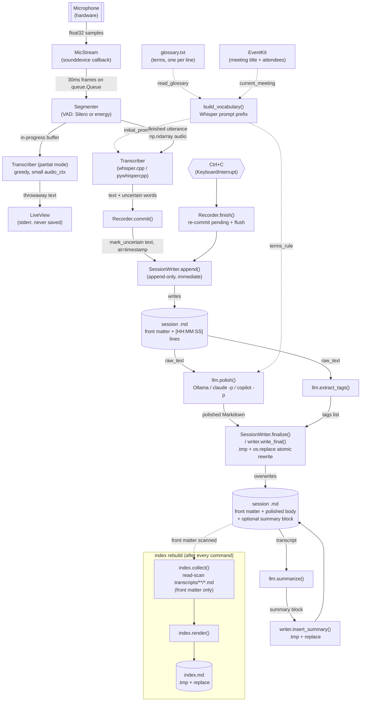

# mic2md — Data Architecture

## Overview

`mic2md` has no database and no server-side state. It is a single-user CLI where every
invocation is one operation that reads and/or writes plain files on the local filesystem
(and, for the LLM passes, sends text over HTTP to a local Ollama server or spawns a
`claude -p` / `copilot -p` subprocess). The filesystem *is* the persistence layer: a
Markdown file per recording session, plus a derived, fully-regenerated `index.md`.

## 1. Data objects

| Object | Type / shape | Produced by | Consumed by |
|---|---|---|---|
| **Audio frame** | `np.ndarray`, float32 mono, 30 ms (480 samples @ 16 kHz) | `MicStream` callback (`audio.py`) | `Segmenter.feed` |
| **Utterance audio** | `np.ndarray`, float32, variable length (concatenated frames, incl. preroll) | `Segmenter._finish` / `.flush()` | `Transcriber.transcribe` |
| **Transcript text (line)** | `str`, cleaned (`clean_text`), optionally with `word(?)` uncertainty markers | `Transcriber.transcribe` + `mark_uncertain` | `SessionWriter.append`, terminal echo (`--transcript`) |
| **Token confidence** | `list[tuple[bytes, float]]` (token bytes, probability) | `Transcriber._text_tokens` | `uncertain_words` → `Transcriber.last_uncertain` |
| **Session Markdown file** | `<output_dir>/transcripts/YYYY-MM/<ISO-timestamp>[-slug].md`: flat `key: value` front matter, then either raw `[HH:MM:SS] text` lines (mid-recording / no-LLM) or a polished body, plus an optional `<!-- mic2md:summary -->…<!-- /mic2md:summary -->` block | `SessionWriter` (raw), `write_final`/`insert_summary` (final) | `parse_document`, `index.collect`, re-`polish`/`summarize` |
| **Front matter** | `dict[str, str]`: `date`, `language`, `whisper_model`, `llm_model`/`summary_model`, `meeting`, `participants`, `tags`, `duration`, `source` (imports) | `SessionWriter.__init__`, `_meeting_meta`, `_import_external` | `render_front_matter`/`split_front_matter`, `index.py` |
| **Tags** | `list[str]`, lowercase-hyphenated, max 8, front matter as one-line YAML flow list `[a, b-c]` | `llm.extract_tags` + `normalize_tag` | `writer.format_tags`/`parse_tags`, `index.known_tags`, `index.render` (Tags section) |
| **Summary block** | Markdown (exec summary, decisions, action-item table, open questions, risks) wrapped in HTML comment markers | `llm.summarize` | `writer.insert_summary`/`extract_summary` |
| **index.md** | `<output_dir>/index.md`: one table per `YYYY-MM` (date, time, meeting, tags) + a `## Tags` section + footer | `index.render` from `index.collect` (scans front matter) | Humans / Obsidian; also read back by `index.known_tags` |
| **glossary.txt** | Plain text, one term per line, `#` comments/blank lines skipped | User-authored, at `--glossary` or `<output_dir>/glossary.txt` | `transcriber.read_glossary` → `build_vocabulary` (Whisper prompt) and `llm.terms_rule` (LLM prompt) |
| **ggml model file** | Binary `.bin` (quantized whisper.cpp weights), cached under `~/.cache/mic2md/models/` (or `MIC2MD_CACHE_DIR`/`XDG_CACHE_HOME`) | Downloaded from Hugging Face by `models.ensure_model`/`download` | `Transcriber.__init__` (via `pywhispercpp.Model`) |
| **Meeting metadata** | `Meeting(title: str, participants: list[str])` | `meetings.current_meeting` (EventKit) or interactive `_ask` prompts | Front matter, `build_vocabulary`, `build_summary_messages` |
| **LLM chat messages** | `list[dict[str, str]]` (`role`, `content`) | `llm.build_messages`/`build_summary_messages`/`build_tags_messages` | `llm.chat` → Ollama `/api/chat`, `claude -p` stdin, or `copilot -p` argv |

## 2. Data access patterns

- **No database.** The filesystem under `--output-dir` (default `~/Documents/mic2md`) is
  the only persistent store. There is no index/cache layer beyond the OS page cache and
  the whisper-model download cache.
- **Append-only writes during recording.** `SessionWriter.append` opens the session file
  in `"a"` mode and writes one `[HH:MM:SS] text` line per finished utterance immediately
  after transcription — before any LLM call — so a crash never loses spoken text. Partial
  (in-progress) transcriptions are never written, only shown in `LiveView`.
- **Atomic rewrite-on-finalize.** Every place that replaces a whole file's contents
  (`writer.write_final`, `insert_summary`, `update_front_matter`, `import_document`,
  `index.update`, `models.download`) writes to a `<name>.tmp` sibling first and then calls
  `Path.replace()`, so a crash mid-write can never leave a half-written file live.
- **Read-scan for index rebuild.** `index.collect` walks `transcripts/**/*.md` with
  `rglob`, reads only the first 4 KB of each file (front matter lives at the top) via
  `parse_document`, and rebuilds the whole `index.md` in memory (`render`) before the
  atomic replace in `index.update`. It is never edited incrementally and is always fully
  disposable/regeneratable (also via `mic2md reindex`).
- **In-memory-only data:** audio frames (queue, never persisted), partial transcripts
  (`LiveView.partial`), per-utterance token confidences (recomputed each call, not
  serialized) — all transient, discarded once a decision (append vs. discard) is made.
- **External reads, no writes:** the ggml model file (downloaded once, then read-only by
  `pywhispercpp`), the glossary (read-only input), EventKit calendar data (read-only
  lookup, never mutated).
- **Import is copy-only.** `polish`/`summarize` on a file outside `--output-dir` copies it
  into `transcripts/YYYY-MM/` (`writer.import_document`); the original source file is never
  modified or deleted.

## 3. Input / output data per unit

`mic2md` is one deployable unit (a single CLI binary/package). Its subcommands are best
read as logical components, each owning a slice of the data flow:

| Subcommand | Input | Output |
|---|---|---|
| `mic2md` (record, default) | Microphone audio, glossary.txt, calendar meeting metadata | New session `.md` (polished + tagged), updated `index.md` |
| `mic2md polish FILE` (`p`) | Existing session `.md` (or external file, imported first) | Same `.md` rewritten in place with polished body + tags; updated `index.md`; stdout gets the polished text if piped |
| `mic2md summarize [FILE]` (`s`) | Existing `.md`, or (no FILE) records first like the default command | `.md` with a summary block inserted at the top + tags; updated `index.md` |
| `mic2md tag [FILES...] \| --all` | Existing session `.md` file(s) | Same file(s) with `tags:` front matter updated; updated `index.md` |
| `mic2md reindex` | All files under `transcripts/` (and any flat legacy files) | Migrated file layout + regenerated `index.md` |
| `mic2md models` | Local model cache + static registry | Table printed to stderr (read-only, no file output) |

Logical entities per component: **Recorder** manages audio frames in flight and the
committed/pending text of the current session; **SessionWriter** owns the one Markdown
file being built (append during recording, atomic overwrite at finalize); **index.py**
owns `index.md` as a derived read-scan artifact; **llm.py** is a pure text-in/text-out
transform (transcript → polished Markdown / summary / tags) with no persistence of its
own; **models.py** owns the ggml binary cache; **meetings.py** is a read-only external
data source (EventKit) with no local persistence.

## 4. Data flow diagram

A static rendering of this diagram is in `docs/data-flow.svg`.
